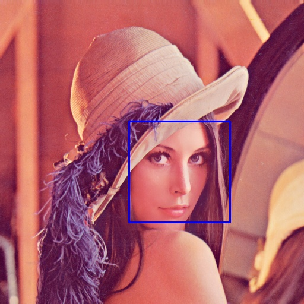
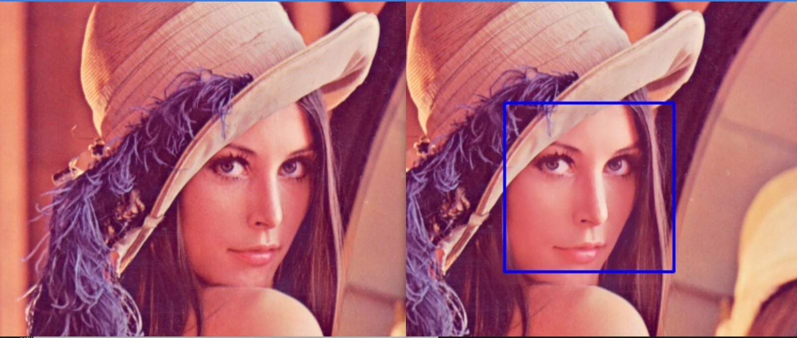

# 数字图像处理-图像滤镜

2019.11.17更新：由于GitHub不支持LaTeX公式解析，图片的排版也有一些格式的区别，所以看README.html中的完整版。

## 一、人像美肤

使用人脸检测 + 自实现的双边滤波，可以对图像中多张人脸进行美肤平滑。

### 1.1 运行环境

- python 3.7
- numpy
- opencv

### 1.2 运行

1. ``cd Skin-Filter``
2. 修改``beatyskin.py``中``main``函数的``filename``为输入图片的路径，默认为data下的图片
3. ``python beatyskin.py``
4. 默认输出在根目录下``newimage.jpg``处理后的图像

### 1.3 算法原理

首先对于输入的图片，调用``detect``函数进行人脸检测。

人脸检测使用了opencv预训练好的模型，模型存在``haarcascade_frontalface_default.xml``中，返回一个list，list中每一项代表存在人脸的一个矩形区域。

对于每个人脸矩形区域，进行双边滤波``bilateral_filter()``。

双边滤波的基本原理是在高斯滤波的基础上，同时考虑模板的空间位置距离和颜色值域的距离。所以在计算卷积模板的时候，需要同时计算两个因素，合成一个卷积模板。根据以下公式进行计算：

$$
w(i,j,k,l) = exp(-\frac{(i-k)^2+(j-l)^2}{2\delta _d^2} - \frac{||I(i,j)-I(k,l)||^2}{2\delta_r^2})
$$

$$
I_D(i,j) = \frac{\sum_{k,l}I(k,l)w(i,j,k,l)}{\sum_{k,l}w(i,j,k,l)}
$$

其中 $I_D(i,j)$代表$pixel(i,j)$的滤波后的像素，需要注意的是，在双边滤波的时候要对图像的三个通道进行分别处理。

**超参数设置：**

1. 卷积模板使用7*7大小
2. $\delta_d$， $\delta_r$代表空间域和像素域的平滑程度，各取20

### 1.4 算法效果

输入一张512*512，tiff格式的Lenna图，左边为滤波前效果，右边为滤波后效果。

细节对比:可以观察到只有在框内的区域进行了平滑。

## 二、晶格化效果

使用超像素分割算法SLIC进行聚类，在每个类中进行均值化。

### 2.1 运行环境

- python 3.7
- skimage
- tqdm
- numpy

### 2.2 运行

1. ``cd SLIC-Superpixels``
2. ``python slic.py``

### 2.3 算法原理

SLIC算法采用了K-means的算法思想，对于像素进行聚类，同时为了降低算法复杂度，只考虑某一区域进行聚类。在考量距离时，同时考虑LAB颜色空间和XY距离空间。

算法的输入只有一个参数K，代表要分割K个像素，假设原来图像有N个像素，则每个超像素大小为N/K，超像素的边长为$S=\sqrt{N/K}$。

首先将K个聚类的中心均匀的分布在图像上，然后调整聚类中心的位置：放在K为中心3*3的区域内梯度最小的点上，这样可以防止超像素中心落在噪点和边界上。

用一个label数组记录像素点属于哪个聚类，dist数组记录到像素中心的距离。

对于聚类中心X，计算周围2S范围内的点，使用公式更新dist数组中的最小距离，并且更新其属于哪个聚类。距离公式如下：

$$
d_c = \sqrt{(l_j - l_i)^2}
$$

$$
d_s = \sqrt{(x_i - x_j)^2 + (y_i - y_j)^2 + (z_i - z_j)^2}
$$

$$
D = \sqrt{d_c^2 + (y_i - y_j)^2 + (\frac{d_s}{S})^2 m^2}
$$

最后对每个聚类内的像素点进行像素平均。

注意要将颜色空间从RGB转换到LAB空间。

**超参数设置：**

iterations = 10 : 根据经验，只需要迭代10次就可以达到收敛条件

K = 1000, 2000, 5000 ：超像素的个数

M = 10-40 ： 颜色空间差异的参数，M越大代表空间相似性起到的作用更大，生成的超像素块越紧凑；越小形状和大小越不规范。

### 2.4 算法效果

K = 1000, M = 10, 20, 40 时效果如下：

M = 10， K = 1000， 2000， 5000时效果如下：

### 2.5 参考文献

[1] Achanta, Radhakrishna, Appu Shaji, Kevin Smith, Aurélien Lucchi, Pascal Fua and Sabine Süsstrunk. SLIC Superpixels Compared to State-of-the-art Superpixel Methods. IEEE Transactions on Pattern Analysis and Machine Intelligence 34, 11 (2012): 8. 2274-2282. https://doi.org/10.1109/TPAMI.2012.120.

